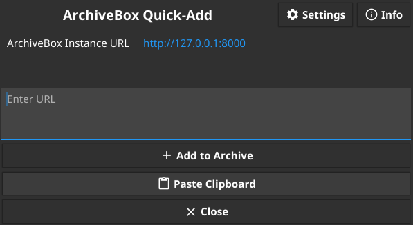
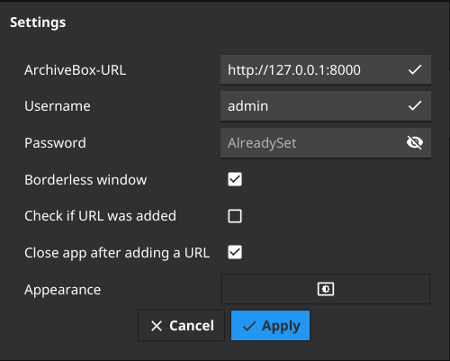

# ArchiveBox QuickAdd

**A simple utility application to quickly archive URLs with an existing
[ArchiveBox](https://github.com/ArchiveBox/ArchiveBox/) instance in the background and without interrupting your current
work.**

Version: 1.8


Developed with [Golang](https://go.dev/) using the [fyne toolkit](https://github.com/fyne-io/fyne).

Please note, that this software is primarily tested on Linux systems at the moment.

*Note:* Because there is no real HTTP API of the ArchiveBox software (yet), the solution used in this app to login and
submit a link should work in general, but this is not how it should be done with an existing HTTP API.

## Features

- Allows you quickly adding a link to ArchiveBox.
    - If your clipboard contains a valid URL, it will be set to the input field on app's startup
    - Shortcut: Type `Ctrl+Return` to archive input link
- Use a borderless window (default: `true`)
- Close app after archive submission (default: `true`)
- Check if URL was added (default: `true`)
- Customize the appearance
- Available in multiple languages
- Have an idea or a question? -> Open an [issue](https://github.com/emschu/archivebox-quick-add/issues/new)

## Upcoming features

- Add tags to a URL
- Select archiving method instead of using all by default
- Provide depth to archiver

## Install, Build and Run

```console
$ go install github.com/emschu/archivebox-quick-add@latest
```
OR:
```
$ fyne get github.com/emschu/archivebox-quick-add
```

Current language support: English and German. Feel free to translate the app and submit a PR!

## Screenshots




## Contributing

If you find a bug or want to request new features, please
use [GitHub issues](https://github.com/emschu/archivebox-quick-add/issues).

Pull Requests are welcome!

## License

The fyne toolkit is licensed under **BSD 3-Clause License**:

```text
Copyright (C) 2018 Fyne.io developers (see AUTHORS)
All rights reserved.
```

This app is distributed under **GNU Affero General Public License v3**. See [LICENSE](./LICENSE) for more information.